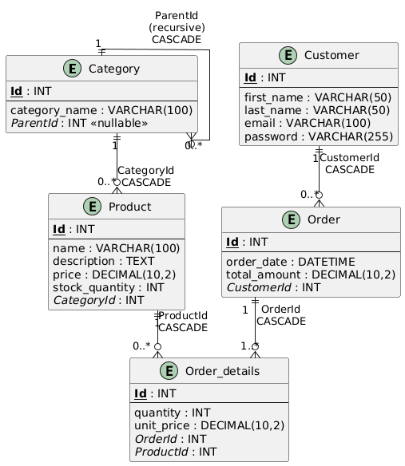
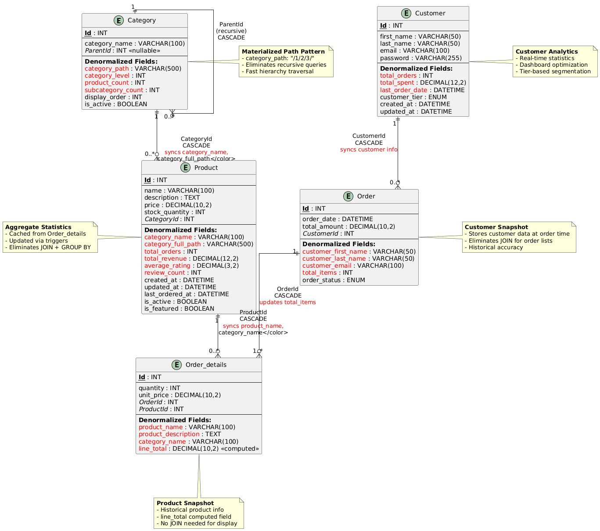

# E-commerce

## 🧠 Vision
The vision of this e-commerce application is to deliver a fast, secure, and intuitive shopping experience where customers can easily browse, purchase, and track products. It also aims to provide sellers with simple tools to manage inventory, orders, and product data while maintaining a scalable and reliable system that supports seamless checkout and secure payments.

---

## 🏢 Domain Problem
The domain problem focuses on the limitations of existing online shopping systems, where customers often face slow interfaces, poor search results, and unreliable checkout processes. Sellers also struggle with managing product information, tracking orders, and keeping inventory accurate. This app solves these issues by offering a centralized, efficient, and user-friendly platform for both buyers and sellers.

---

## 🧩 ERD of the Entity



## 🧩 Denormalized ERD
Note: This erd is for exercise purposes it is not optimal it was done to improve query performance.



## 💻 SQL Quires

* Write an SQL query to generate a daily report of the total revenue for a specific date.
```plaintext
SELECT 
    DATE(o.order_date) AS report_date,
    COUNT(DISTINCT o.Id) AS total_orders,
    SUM(od.quantity * od.unit_price) AS total_revenue,
    AVG(od.quantity * od.unit_price) AS avg_order_value,
    SUM(od.quantity) AS total_items_sold
FROM `Order` o
INNER JOIN Order_details od ON o.Id = od.OrderId
WHERE DATE(o.order_date) = '2024-11-01'  -- Specific date
GROUP BY DATE(o.order_date);
```
-- Daily revenue for a date range
```
SELECT 
    DATE(order_date) AS report_date,
    COUNT(Id) AS total_orders,
    SUM(total_amount) AS total_revenue,
    AVG(total_amount) AS avg_order_value
FROM `Order`
WHERE order_date BETWEEN '2024-11-01' AND '2024-11-30'
GROUP BY DATE(order_date)
ORDER BY report_date;

```

---

* Write an SQL query to generate a monthly report of the top-selling products in a given month.
```plaintext
SELECT 
    p.Id AS product_id,
    p.name AS product_name,
    c.category_name,
    SUM(od.quantity) AS total_quantity_sold,
    SUM(od.quantity * od.unit_price) AS total_revenue,
    COUNT(DISTINCT od.OrderId) AS number_of_orders,
    AVG(od.unit_price) AS avg_price
FROM Order_details od
INNER JOIN Product p ON od.ProductId = p.Id
INNER JOIN Category c ON p.CategoryId = c.Id
INNER JOIN `Order` o ON od.OrderId = o.Id
WHERE YEAR(o.order_date) = 2024 
  AND MONTH(o.order_date) = 11  -- November 2024
GROUP BY p.Id, p.name, c.category_name
ORDER BY total_quantity_sold DESC
LIMIT 10;  -- Top 10 products
```

-- Top-selling products by revenue (not quantity)
```plaintext

SELECT 
    ProductId AS product_id,
    product_name,
    category_name,
    SUM(quantity) AS total_quantity_sold,
    SUM(line_total) AS total_revenue,
    COUNT(DISTINCT OrderId) AS number_of_orders
FROM Order_details od
INNER JOIN `Order` o ON od.OrderId = o.Id
WHERE YEAR(o.order_date) = 2024 
  AND MONTH(o.order_date) = 11
GROUP BY ProductId, product_name, category_name
ORDER BY total_revenue DESC
LIMIT 10;
```
-- Top-selling products by category
```plaintext
SELECT 
    category_name,
    product_name,
    SUM(quantity) AS total_quantity_sold,
    SUM(line_total) AS total_revenue,
    RANK() OVER (PARTITION BY category_name ORDER BY SUM(quantity) DESC) AS rank_in_category
FROM Order_details od
INNER JOIN `Order` o ON od.OrderId = o.Id
WHERE YEAR(o.order_date) = 2024 
  AND MONTH(o.order_date) = 11
GROUP BY category_name, product_name
HAVING rank_in_category <= 5  -- Top 5 per category
ORDER BY category_name, rank_in_category;
```


---

* Write a SQL query to retrieve a list of customers who have placed orders totaling more than $500 in the past month.
```plaintext
SELECT 
    c.Id AS customer_id,
    c.first_name,
    c.last_name,
    c.email,
    COUNT(o.Id) AS total_orders,
    SUM(o.total_amount) AS total_spent,
    AVG(o.total_amount) AS avg_order_value,
    MAX(o.order_date) AS last_order_date
FROM Customer c
INNER JOIN `Order` o ON c.Id = o.CustomerId
WHERE o.order_date >= DATE_SUB(CURDATE(), INTERVAL 1 MONTH)
GROUP BY c.Id, c.first_name, c.last_name, c.email
HAVING SUM(o.total_amount) > 500
ORDER BY total_spent DESC;


```

